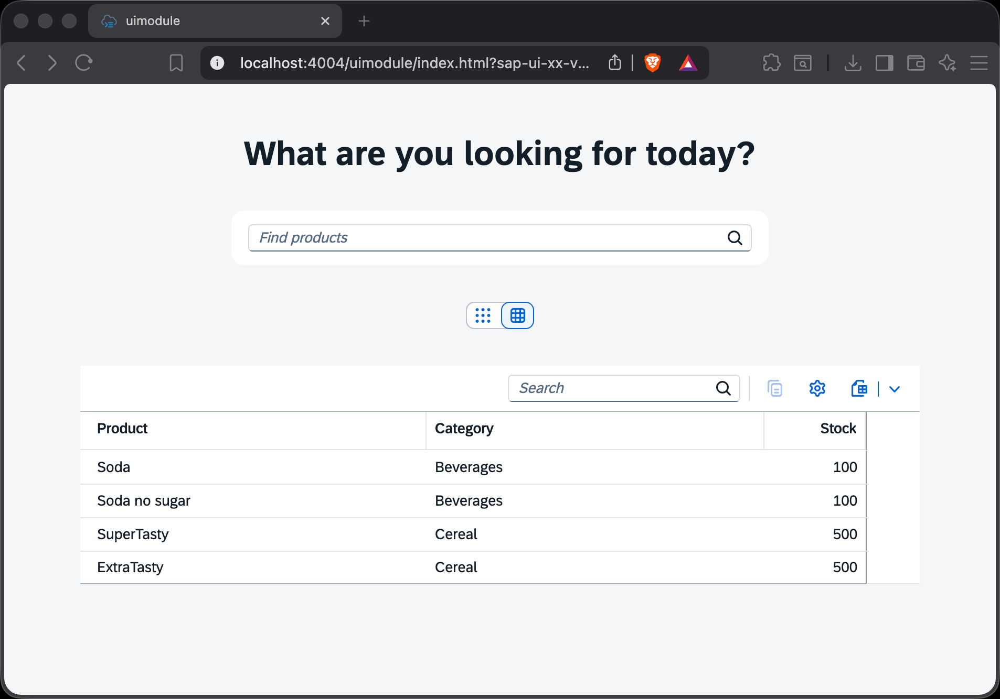

# Chapter 04 - Using the FPM Table Building Block

By the end of this chapter we will have added an [SAP Fiori elements building block](https://ui5.sap.com/#/topic/one-buildingblock-overview) - the `Table` building block - next to our existing tile list, and we will let users toggle between the two with a segmented button.

## Steps

- [1. Add UI annotations to the CAP service](#1-add-ui-annotations-to-the-cap-service)<br>
- [2. Declare the `sap.fe.macros` library](#2-declare-the-sapfemacros-library)<br>
- [3. Add the Table building block and a view toggle to the XML view](#3-add-the-table-building-block-and-a-view-toggle-to-the-xml-view)<br>
- [4. Implement the toggle in the controller](#4-implement-the-toggle-in-the-controller)<br>
- [5. Test the application](#5-test-the-application)<br>

## Background Information

In the [previous chapter](/chapters/03-adding-content-to-ui5-app/) we rendered the products as a freestyle tile list (an `HBox` of `GenericTile`s), where we manually bound each control property to a data model path. That is the "freestyle" side of the SAP Fiori elements flexible programming model (FPM).

The FPM also lets us use **building blocks** (also called *macros*), which are high-level, metadata-driven controls from the `sap.fe.macros` library. Instead of hand-crafting a control tree, we point a building block at an **annotation** in the OData service metadata, and SAP Fiori elements renders a fully-featured control for us - including things like search, sorting, column personalization, and export "for free".

The [`Table` building block](https://ui5.sap.com/#/api/sap.fe.macros.Table) is the most prominent example. It renders a table based on a [`UI.LineItem`](https://ui5.sap.com/#/topic/1already) annotation that describes which columns to display. In this chapter we will add such a table *next to* our tile list, so we can directly compare the freestyle and the building-block approach - and switch between them with a button.

### 1. Add UI annotations to the CAP service

The `Table` building block is annotation-driven, so first we need to tell the backend which columns the table should display. In a CAP project, UI annotations belong in the CDS layer. CAP automatically embeds them into the OData `$metadata` document that the service exposes - no additional configuration in the UI5 app is required.

➡️ Create a new file `codejam.supermarket/server/srv/annotations.cds` with the following content:

```cds
using CatalogService from './cat-service';

annotate CatalogService.Products with @(
    UI.LineItem: [
        { $Type: 'UI.DataField', Value: title,         Label: 'Product' },
        { $Type: 'UI.DataField', Value: category_name, Label: 'Category' },
        { $Type: 'UI.DataField', Value: stock,         Label: 'Stock' }
    ]
);

annotate CatalogService.Products with {
    title        @title: 'Product';
    category     @title: 'Category';
    stock        @title: 'Stock';
}
```

The `UI.LineItem` annotation defines a collection of `UI.DataField` records - one per column - each pointing at a property of the `Products` entity (`title`, `category_name`, `stock`) with a human-readable `Label`. The second `annotate` statement adds `@title` labels that SAP Fiori elements uses in various places (for example the column personalization dialog).

<details>
<summary>Why <code>category_name</code> and not <code>category</code>? 💬</summary>

<br>

> In our data model, `Products.category` is an association to the `Categories` entity (whose key is `name`). OData V4 exposes the foreign key of a to-one association as a flattened property - here `category_name` (you can see it in the `$metadata` and in our sample data CSV). Pointing the column at the flattened `category_name` property is the simplest way to show the category text without configuring a navigation or a `Common.Text` annotation.

</details>

### 2. Declare the `sap.fe.macros` library

The `Table` building block lives in the `sap.fe.macros` library, which is not yet part of our application's dependencies. We need to declare it in two places.

➡️ Add `sap.fe.macros` to the `sap.ui5.dependencies.libs` section of the `codejam.supermarket/uimodule/webapp/manifest.json` file:

```json
        "sap.fe.macros": {}
```

➡️ Also add it to the `framework.libraries` section of the `codejam.supermarket/uimodule/ui5.yaml` file:

```yaml
    - name: sap.fe.macros
```

The `manifest.json` entry makes the library available to the running application, while the `ui5.yaml` entry makes the UI5 Tooling aware of it (for example when serving or building the app).

### 3. Add the Table building block and a view toggle to the XML view

Now we can use the building block in our view. We will keep the existing tile list, add the `Table` building block next to it, and add a `SegmentedButton` that toggles which one is visible.

➡️ Add the `macros` namespace to the opening `<mvc:View>` tag at the top of the `codejam.supermarket/uimodule/webapp/ext/view/Main.view.xml` file:

```xml
xmlns:macros="sap.fe.macros"
```

➡️ Add the following `SegmentedButton` right after the closing `</Panel>` tag (above the `HBox` with `id="products"`):

```xml
				<SegmentedButton
					id="viewToggle"
					selectedKey="{view>/mode}"
					selectionChange=".onToggleView"
					class="sapUiMediumMarginTop">
					<items>
						<SegmentedButtonItem id="viewToggleList" key="list" icon="sap-icon://grid" tooltip="List" />
						<SegmentedButtonItem id="viewToggleTable" key="table" icon="sap-icon://table-view" tooltip="Table" />
					</items>
				</SegmentedButton>
```

➡️ Add a `visible` attribute to the existing `HBox` with `id="products"` so the tile list only shows in "list" mode:

```xml
				visible="{= ${view>/mode} === 'list' }"
```

➡️ Finally, add the `Table` building block right after the closing `</HBox>` tag (still inside the inner `<VBox alignItems="Center">`):

```xml
				<VBox
					id="productsTableContainer"
					visible="{= ${view>/mode} === 'table' }"
					width="800px"
					class="sapUiMediumMarginTop">
					<macros:Table
						id="productsTable"
						metaPath="@com.sap.vocabularies.UI.v1.LineItem"
						contextPath="/Products"
						rowPress=".onRowPress" />
				</VBox>
```

The `contextPath="/Products"` tells the building block which entity set to bind to, and `metaPath="@com.sap.vocabularies.UI.v1.LineItem"` points it at the annotation we created in step 1. That is all the building block needs to render a full table - notice how little markup this is compared to the freestyle `HBox`/`GenericTile` list. The `rowPress` event points at an `onRowPress` handler that we will implement in [Chapter 06](/chapters/06-custom-controls-and-third-party-packages/), together with the tile's `onTilePress` handler, to navigate the 3D model when a product is selected. The visibility of both the tile list and the table is controlled by an [expression binding](https://ui5.sap.com/#/topic/daf6852a04b44d118963968a1239d2c0) against a `view` model that we will set up in the next step.

<details>
<summary>Why is the <code>macros:Table</code> wrapped in a <code>VBox</code>? 💬</summary>

<br>

> The `sap.fe.macros.Table` building block does not have a `visible` property of its own that we can bind to. By wrapping it in a simple `VBox` and toggling the visibility of that container, we can show and hide the whole table. The fixed `width` also gives the responsive table enough room to display all three columns side by side.

</details>

### 4. Implement the toggle in the controller

The view references a `view` model (for the current mode) and an `onToggleView` handler, which we now need to provide.

➡️ Replace the commented-out `onInit` stub in the `codejam.supermarket/uimodule/webapp/ext/view/Main.controller.ts` file with the following method:

```typescript
	public onInit(): void {
		super.onInit(); // needs to be called to properly initialize the page controller
		// local view model to control whether the products are shown as a tile list or an FPM table
		this.getView()?.setModel(new JSONModel({ mode: "list" }), "view");
	}
```

➡️ Add the following method next to the other event handlers (for example after `onSearchProducts`):

```typescript
	public onToggleView(event: SegmentedButton$SelectionChangeEvent): void {
		// the "view" model's "mode" is two-way bound to the SegmentedButton, which in turn
		// drives the visibility of the tile list and the FPM table via expression binding.
		// This handler is a hook for any additional logic when switching views.
		const mode = event.getParameter("selectedKey");
		MessageToast.show(`Switched to ${mode} view.`);
	}
```

➡️ Also make sure to add the following import statements to the top of the same file:

```typescript
import { SegmentedButton$SelectionChangeEvent } from "sap/m/SegmentedButton";
import JSONModel from "sap/ui/model/json/JSONModel";
import MessageToast from "sap/m/MessageToast";
```

We set up a small named JSON model (`view`) with a `mode` property that defaults to `"list"`. The `SegmentedButton`'s `selectedKey` is two-way bound to `view>/mode`, so selecting a segment updates the model, and the `visible` expression bindings on the tile list and the table react automatically. The `onToggleView` handler itself is not strictly required for the toggle to work (the binding does the job), but it is a convenient place to react to the switch - here we simply show a message toast.

<details>
<summary>A few more thoughts on building blocks vs. freestyle ... 💬</summary>

<br>

> Building blocks shine when your UI closely follows SAP Fiori guidelines and your data is well annotated: you get a lot of standard functionality (search, sort, filter, personalization, export) with almost no code, and it stays consistent with SAP Fiori elements applications. Freestyle controls (like our tile list) give you full control over layout and behavior, which is exactly what we needed for the visual, tile-based product browsing that drives the 3D model. The flexible programming model lets us mix both in the same app - use the right tool for each part of the UI.

</details>

### 5. Test the application

➡️ Refresh your browser window at `http://localhost:4004/` and test the application. In case you closed your server, restart it with the following command from the project root:

```bash
npm run dev:server
```

The application now shows a segmented button below the search field. It starts in "list" mode with the familiar product tiles. Switch to "table" mode and you will see the `Table` building block, rendered entirely from the `UI.LineItem` annotation, with the columns Product, Category, and Stock - plus a built-in search field and personalization options in the table toolbar. Switch back to "list" mode to return to the tiles. Both the tiles and the table rows will fly the 3D camera to the selected product once you have built the custom control and its handlers in [Chapter 06](/chapters/06-custom-controls-and-third-party-packages/).



## Further question to discuss

<details>
<summary>How could you verify that the annotation actually reached the OData service?</summary>

<br>

> Open the service metadata document at [http://localhost:4004/odata/v4/catalog/$metadata]() in your browser and search for `UI.LineItem`. You should find an `Annotation` element with a `Collection` of three `UI.DataField` records pointing at `title`, `category_name`, and `stock`. This is exactly what the `Table` building block reads at runtime to decide which columns to render. If the annotation is missing here, the table would come up empty - a good first place to look when debugging building blocks.

</details>

<details>
<summary>Why did we not have to register an annotation data source in the <code>manifest.json</code>?</summary>

<br>

> In a fully freestyle app consuming a remote service, UI annotations often live in a separate annotation file that you register as an additional data source in the `manifest.json`. In our CAP-based setup, the annotations are part of the CDS model and CAP embeds them directly into the service's `$metadata`. Since our default OData model already consumes that service, the annotations are available automatically - the `annotations` array of our data source can stay empty.

</details>

<br>

Continue to [Chapter 05 - Adding OData V4 Actions and Debugging](/chapters/05-adding-odata-v4-actions-and-debugging/)
